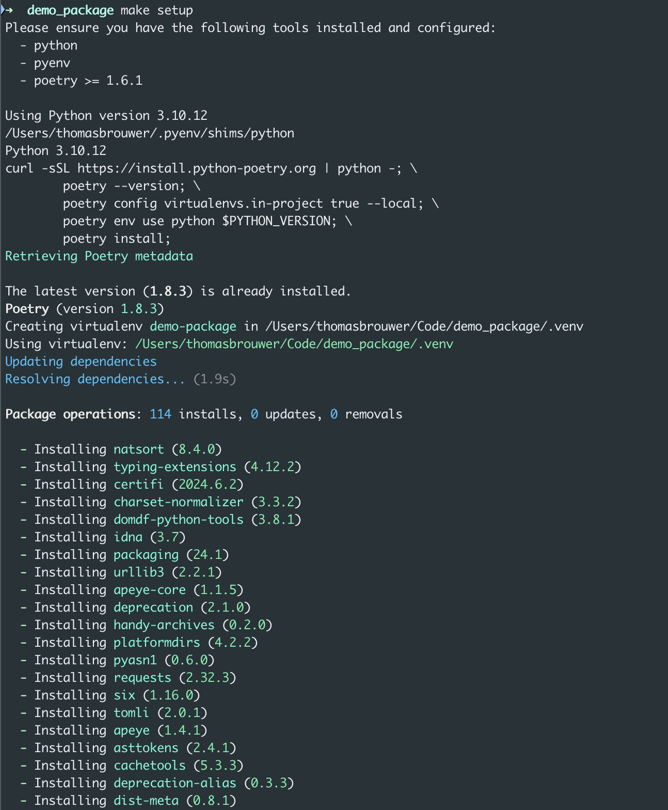
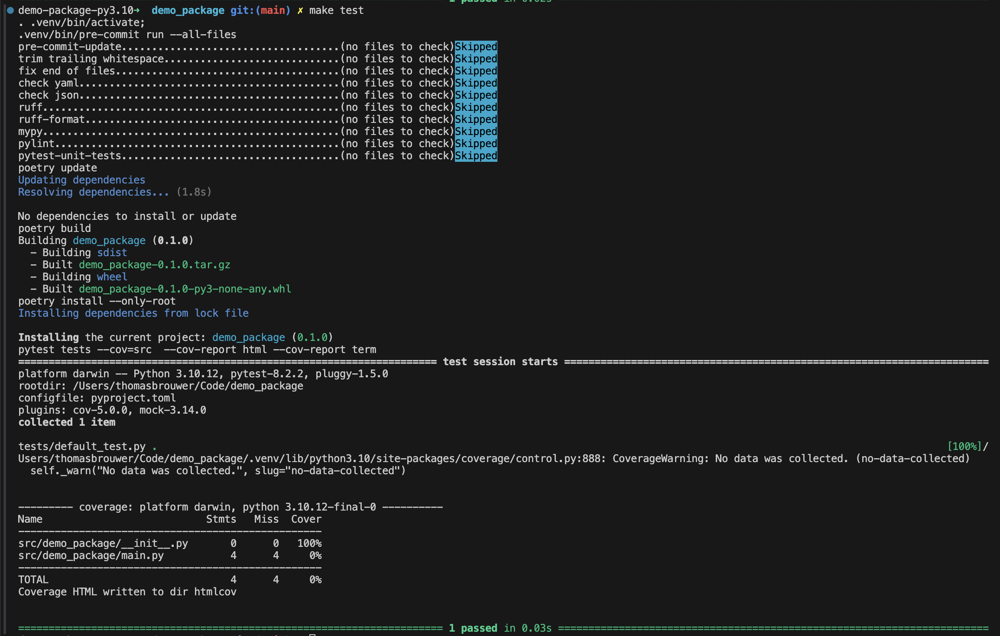
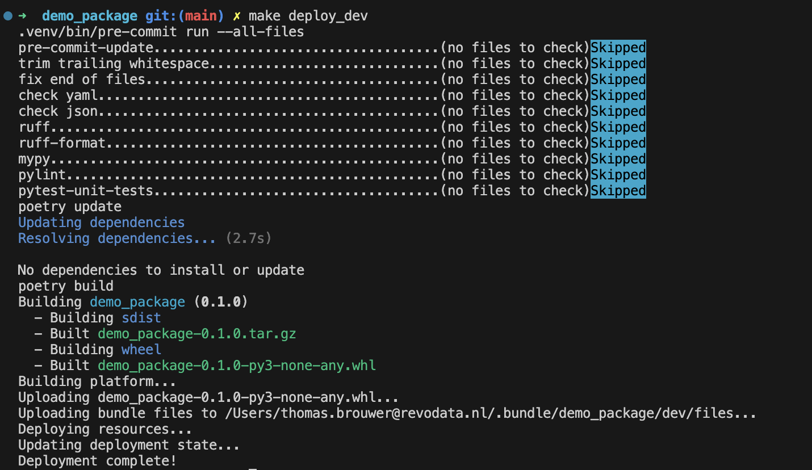

# test_bundles

[](https://www.python.org)
[](https://github.com/astral-sh/ruff)
[](http://mypy-lang.org/)
[](https://github.com/pre-commit/pre-commit)
[](https://github.com/revodatanl/test_bundles/actions/workflows/ci.yml)
[](https://github.com/revodatanl/test_bundles/actions/workflows/semantic_release.yml)
[](https://github.com/revodatanl/test_bundles/blob/main/assets/coverage.svg)

The `test_bundles` Bundle was generated by using the [RevoData Asset Bundle Template](https://github.com/revodatanl/revo-asset-bundle-templates) version `0.3.0`.

### Pre-requisites

- [Databricks CLI](https://docs.databricks.com/dev-tools/cli/databricks-cli.html) (installed and configured)
- [Git](https://git-scm.com)
- [Poetry](https://python-poetry.org/docs) >= 1.6.1
- [pyenv](https://github.com/pyenv/pyenv)
- [Python](https://www.python.org)

The `test_bundles` Bundle utilizes a `Makefile` to simplify the Databricks Asset Bundle deployment process, although technically this is not a requirement.

## Getting started

To set up a fully configured development environment for this project run the following command:

```bash
make setup
```

This will use [pyenv](https://github.com/pyenv/pyenv) to configure the correct [Python](https://www.python.org/) version specified in the `.python-version` file. Subsequently it will use [Poetry](https://python-poetry.org/docs/) to install the dependencies, set up a virtual environment, activate it, and install the pre-commit hooks. Note that the default project configuration matches Databricks Runtime 14.3 LTS (Python 3.10.12, Apache Spark 3.5.0, and pandas 1.5.3).



## RevoData Modules

To add our custom modules to your project, run the following command:

```bash
make module
```


## Create GitHub repository

To create a repository in RevoData's GitHub, and add a remote to the local git repository containing the Bundle, use the following commands:

```bash
make repo
```

This assumes that access to the RevoData GitHub organization is granted and configured.


## Development

The following commands are available for development:

```bash
make clean
```


This command deactivates the virtual environment, removes the virtual environment and the `poetry.lock` file, and removes any caches.


```bash
make test
```

This command runs the tests for the project.



## Deployment

To deploy the Bundle to Databricks with ease, use the following commands:

### `dev` environment

To deploy the Bundle to the (default) `dev` target:

```bash
make deploy_dev
```

This will deploy the Bundle to the Databricks workspace, using the `~/.databrickscfg` profile specified during initialization.



### `prod` environment

To deploy the Bundle to the `prod` target:

```bash
make deploy_prod
```
## Bundle Destruction

To remove the Bundle from the Databricks workspace, use the following command:

```bash
make destroy_dev # or make destroy_prod
```


